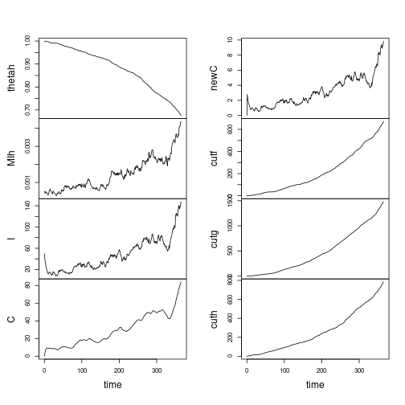

# `spam.mpxv`: Stochastic pair approximation model for Monkeypox virus

Population structure is modelled as a dynamic network based on behavioural surveillance of MSM. 
Each individual has a mixture of long-duration and short-duration(casual) contacts as well as one-off contacts. 

Degree distributions and partnership durations are based on: [Anderson et al., Epidemiology 2021](http://dx.doi.org/10.1097/EDE.0000000000001390)

Relative contact rates for different contact types are based on [Jenness et al., JID 2016](https://doi.org/10.1093%2Finfdis%2Fjiw223)

The model is designed within the 'edge-based compartmental'(EBCM) framework laid out in 

- Miller JC, Volz EM. Model hierarchies in edge-based compartmental modeling for infectious disease spread. J Math Biol. 2013;67: 869–899. doi:10.1007/s00285-012-0572-3
- Volz E, Meyers LA. Susceptible–infected–recovered epidemics in dynamic contact networks. Proceedings of the Royal Society B. 2007. Available: https://royalsocietypublishing.org/doi/abs/10.1098/rspb.2007.1159

A system of stochastic differential equations were designed around the EBCM by introducing Guassian noise on 1) the force of infection and 2) the average degree among new infected individuals. 

The model is designed to work with the `pomp` package for simulation and model fitting. 


## Example simulation 


```r
library( spam.mpxv )
set.seed( 1111 ) 
st0 <- Sys.time() 
# Model m1.0 implements the first basic model with three contact types 
# Default parameters are not calibrated and only for demonstration
s1 <- pomp::simulate( m1.0 )
st1 <- Sys.time() 
print( st1 - st0 )
```

```
## Time difference of 0.02852178 secs
```

```r
plot( s1 ) 
```



```r
s1d <- as.data.frame( s1 ) 
print( tail( s1d ))
```

```
##     time  Y    thetaf      MSSf         MSIf         MIf    thetag      MSSg
## 361  360  9 0.9856374 0.9741526 0.0008102571 0.001757727 0.9791168 0.9347904
## 362  361  9 0.9855477 0.9739874 0.0007518649 0.001723143 0.9790427 0.9343921
## 363  362  4 0.9854356 0.9737356 0.0007950649 0.001779421 0.9788797 0.9339758
## 364  363  5 0.9852114 0.9735310 0.0007803058 0.001782537 0.9787166 0.9334760
## 365  364 12 0.9851217 0.9732727 0.0008217439 0.001838182 0.9785090 0.9329263
## 366  365  4 0.9849423 0.9730680 0.0007994520 0.001834422 0.9783014 0.9323973
##            MSIg         MIg    thetah         MIh        I        C     newC
## 361 0.001657207 0.002856822 0.6887153 0.004065287 139.9302 77.34825 9.328677
## 362 0.001547834 0.002771846 0.6859710 0.004053751 133.6085 78.52066 8.907231
## 363 0.001479684 0.002714983 0.6828960 0.004133549 136.3404 79.75795 9.089359
## 364 0.001506356 0.002746972 0.6815355 0.004141492 138.6170 81.02329 9.241133
## 365 0.001576219 0.002825439 0.6784804 0.004308352 142.5142 82.42190 9.500944
## 366 0.001609070 0.002872226 0.6761148 0.004375769 147.7618 84.03050 9.850787
##     cutf cutg cuth
## 361  641 1426  747
## 362  645 1431  755
## 363  650 1442  764
## 364  660 1453  768
## 365  664 1467  777
## 366  672 1481  784
```

```r
#~ with( s1d, plot( time, I, type='l', log='y') )
```

How long does it take to run a particle filter on the simulated data? 

```r
print(
	system.time(pfilter(s1,Np=100))
)
```

```
##    user  system elapsed 
##   2.485   0.008   2.493
```


## Roadmap 2022-06-03

- Revise natural history parameters, realistic generation time distribution 
- Calibrate population size and seeding dates to UK epidemic 
